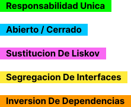
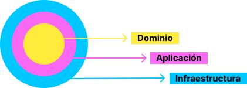
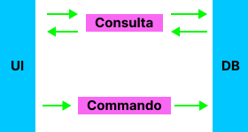
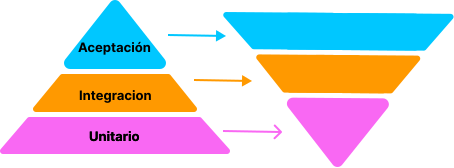
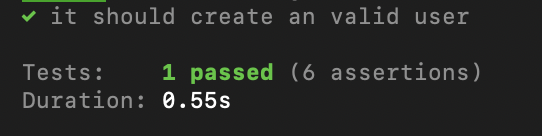
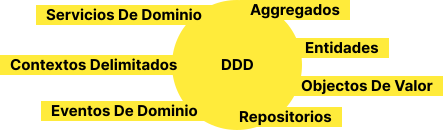
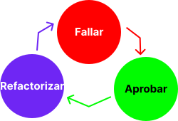

# Temario - Caso de Uso: Crear Usuario


### En este temario trabajaremos con el caso de uso de crear usuario!

###### Que??? Solo eso??? Si yo en 10 lineas de mi controlador puedo hacerlo!😀

###### Efectivamente solo sera ese caso de uso, con una enorme diferencia!

### 🚀<span style="color:blue">SOBRE-INGENERIA DE SOFWARE!</span>🚀

#### Spoiler final de como quedara nuestro controlador!

````php
final class CreateUserController extends BaseController
{
    public function __invoke(string $uuid, Request $request): JsonResponse
    {
        $this->dispatch(
            new CreateUserCommand(
                uuid    : $uuid,
                email   : $request->email,
                password: $request->password,
            )
        );

        response()->json(null, Response::HTTP_CREATED);
    }
}
````

## Breve introducción de algunos conceptos que abordaremos

**🏋️‍♂️ SOLID y CÓDIGO LIMPIO**

- Definición de SOLID y su importancia en el desarrollo de software.
- Visión general de cada uno de los cinco principios.
- ALgunos antipatrones.

<br>

<div align="center">

</div>
<br>
<br>
<br>

**🏋️‍♂️ ARQUITECTURA HEXAGONAL**

- Descripción de la Arquitectura Hexagonal y su relevancia en el desarrollo de software.
- Exploración de las capas y principios fundamentales.
- Ejemplos prácticos de implementación.

<br>

<div align="center">

</div>

<br>
<br>
<br>

**🏋️‍♂️ CQRS**

- Definición y relevancia de CQRS en el desarrollo de software.
- Principios clave de CQRS y su aplicación en un diseño limpio.
- Ejemplos prácticos de implementación.
- Read model y Write model.
- Antipatrones comunes.

<br>

<div align="center">
  
</div>

**🏋️‍♂️Pirámide De Test**

- **Pruebas Aceptación**
- **Pruebas de Integración**
- **Pruebas de Unitarias**

<br>

<div align="center">

</div>

**🏋️‍HAPPY PATH**

<div align="center">
  
</div>

<br>
<br>
<br>

**🏋️‍♂️ Arquitectura Orientada a Eventos**

- Descripción de la arquitectura orientada a eventos y su relevancia en el backend.
- Ejemplos de implementación de eventos y sus beneficios en sistemas distribuidos.
- Antipatrones.

<br>

<div align="center">
  
</div>

<br>
<br>
<br>

**🏋️‍♂️ Diseño Dirigido por el Dominio**

- Ejemplos prácticos de cómo aplicar el lenguaje ubícuo y modelar el dominio de negocio de manera efectiva.
- Como impulsar los requerimientos de negocio a lo mas profundo de nuestro dominio.
- Antipatrones.

<br>

<div align="center">
  
</div>

<br>
<br>
<br>

**🏋️‍🔬️ Desarrollo Dirigido por Pruebas**

- Introducción a la metodología TDD y su importancia en el desarrollo de software.
- Ciclo de desarrollo en TDD: Rojo -Verde -Refactorizar.
- Beneficios de la implementación de TDD en el proceso de desarrollo.

<br>

<div align="center">
  
</div>

<br>
<br>
<br>