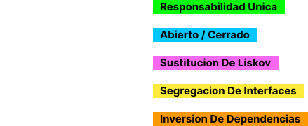

# Temario - Caso de Uso: Crear Usuario


### En este temario solo y unicamnte trabajaremos con el caso de uso de crear usuario!

###### Que??? Solo eso??? Si yo en 10 lineas de mi controlador puedo hacerlo!😀

###### Efectivamente solo sera ese caso de uso, con una enorme diferencia!

### 🚀<span style="color:blue">SOBRE-INGENERIA DE SOFWARE!</span>🚀

#### Spoiler final de como quedara nuestro controlador!

````php
final class CreateUserController extends BaseController
{
    public function __invoke(string $uuid, Request $request): JsonResponse
    {
        $this->dispatch(
            new CreateUserCommand(
                uuid    : $uuid,
                email   : $request->email,
                password: $request->password,
            )
        );

        response()->json(null, Response::HTTP_CREATED);
    }
}
````

## Breve introducción de lo que abordaremos

**🏋️‍♂️ SOLID y CÓDIGO LIMPIO**

- Definición de SOLID y su importancia en el desarrollo de software.
- Visión general de cada uno de los cinco principios.
- ALgunos antipatrones.
-

<div align="center">

</div>
<br>
<br>
<br>
**🏋️‍♂️ ARQUITECTURA HEXAGONAL**

- Descripción de la Arquitectura Hexagonal y su relevancia en el desarrollo de software.
- Exploración de las capas y principios fundamentales.
- Ejemplos prácticos de implementación.

<div align="center">

</div>
<br>
<br>
<br>
**🏋️‍♂️ CQRS**

- Definición de SOLID y su importancia en el desarrollo de software.
- Visión general de cada uno de los cinco principios.
- ALgunos antipatrones.
-

<div align="center">
  
</div>

